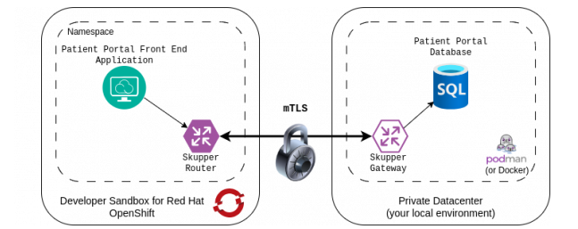
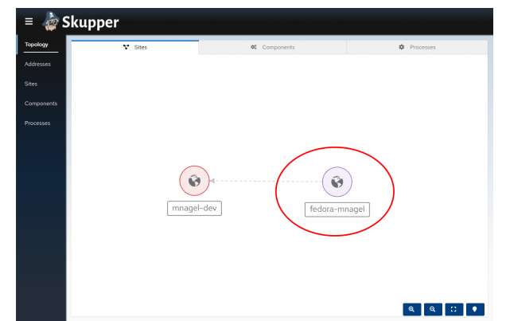
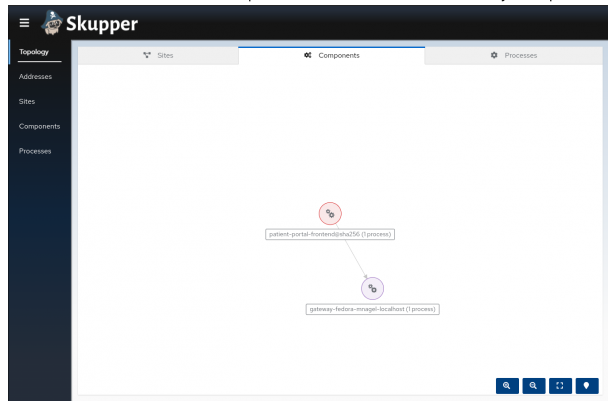

# Red Hat Service Interconnect 

[Red Hat Service Interconnect](https://www.redhat.com/en/technologies/cloud-computing/service-interconnect) \
[Skupper.io](https://skupper.io/)


## Use Cases 

- Load Balance between two clusters
- Connect private VM with cluster


## Demo Connect local DB with Cluster

https://developers.redhat.com/developer-sandbox/activities/connect-services-across-different-environments

## Architecture



## Setup

1. Apply Deployment in cluster

Apply the frontend to the cluster to have a running frontend with included backend

```bash
oc apply -f patient-portal-frontend-deploy.yaml
```

2. Install the database on your local machine

-> On Mac use docker

```bash
docker run --name database --detach --rm -p 5432:5432 quay.io/redhatintegration/patient-portal-database-arm64
```

3. Install skupper cli locally

```bash
curl https://skupper.io/install.sh | sh

export PATH="/Users/vravula/bin:$PATH"
```

4. Install skuper on your cluster (need to be logged in and select project before)

```bash
skupper init --enable-console --enable-flow-collector --console-auth unsecured
````

5. Check skupper 

```bash
skupper status
```

6. Initialize Gateway


```bash
skupper gateway init --config simple_docker.yaml --type docker
````



7. Expose the database service

```bash
skupper expose service database --address database --port 5432 --protocol tcp
```




8. Check oc proxy service 

```bash
oc get service
````

You should see a service database


